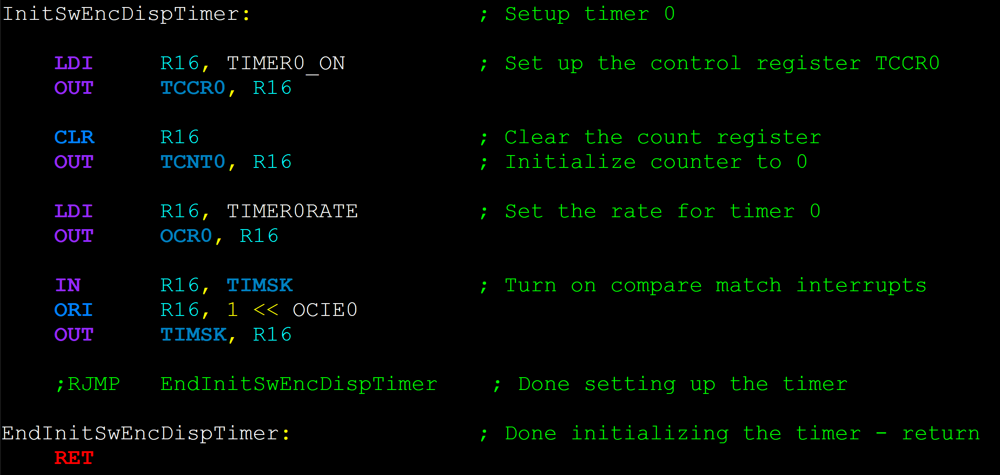
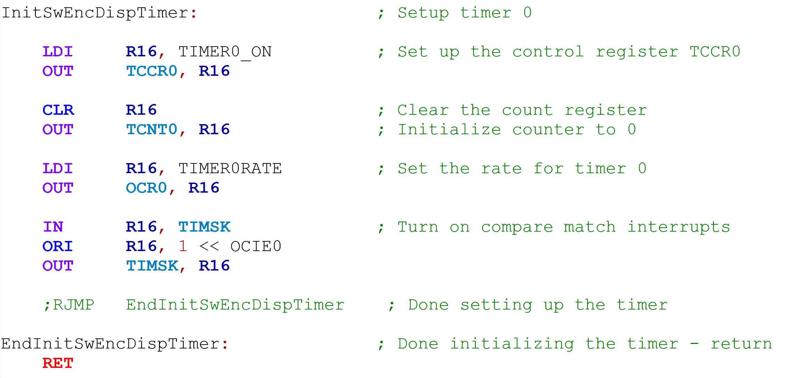

# avrasm-npp
UDL files for AVR Assembly syntax highlighting with Notepad++

## Description

This project is a set of user defined language files for Notepad++ that does syntax highlighting for AVR assembly `.asm` and `inc` files. Dark and light variations are provided.

## Screenshots

### AVR Assembly Dark

### AVR Assembly Light

## Usage

Installation instructions:

1. Download the desired language file, or clone the repository.
2. In Notepad++ : 
   1. Choose menu `Language` > `Define your own language`.
   2. In the window that appears, click `Import`.
   3. In the file browser, browse to and select your downloaded `.xml` file, and click `Open`.
   4. Wait for the 'Import Successful' dialog to be shown.
3. Open an AVR assembly file in Notepad++ (file extension must be `.asm` or `.inc`). Under the `Languages` drop down, select the name of the UDL.
4. Enjoy!

## Licensing

This project is released under the terms of the MIT License.
